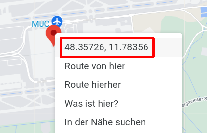
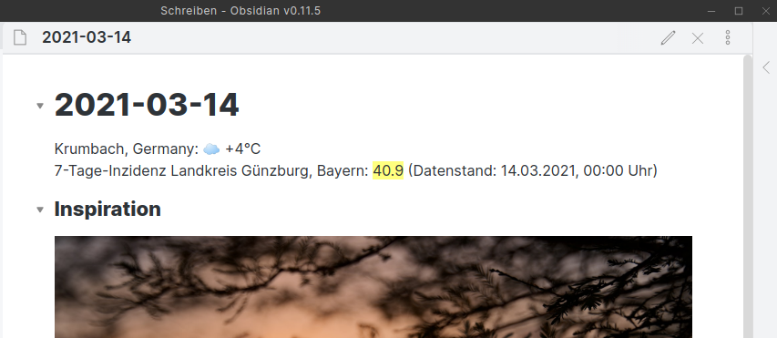

# inzidenz

*(Sorry, English readers: This program follows some German Covid-19 regulations and only works for geo coordinates within Germany. Thus, all explanations are in German only.)*

Farbcodierte Anzeige der aktuellen **Covid-19 7-Tage-Inzidenz** für Landkreise/kreisfreie Städte in Deutschland auf der Kommandozeile.

Geschrieben in *Python3*, es sollte damit auf allen Systemen laufen, auf denen Python3 installiert ist.

Das Programm zeigt den aktuellen 7-Tage-Inzidenzwert farbcodiert an, basierend auf Geo-Koordinaten (latitude, longitude), wie man sie z.B. bei [OpenStreetMap](https://www.openstreetmap.org/search?query=52.52134162768218%2C13.41327381161729#map=19/52.52134/13.41327) oder [Google Maps](https://www.google.com/maps/place/52%C2%B031'16.8%22N+13%C2%B024'47.8%22E/@52.5213416,13.4110851,17z/data=!3m1!4b1!4m5!3m4!1s0x0:0x0!8m2!3d52.5213416!4d13.4132738) abfragen kann:


Die Daten werden direkt vom Robert-Koch-Institut (COVID-19 Datenhub) bezogen (Danke.)

Um eine leichte Weiterverwendung in anderen Programmen zu ermöglichen, kann in folgenden Formaten ausgegeben werden: **ohne Farbcodierung**, mit **Terminal-Farbcodierung**, mit **HTML-Farbcodierung** und als **CSV** (mit und ohne Kopfzeile). Außerdem gibt es eine _kurze_ und eine _längere_ Ausgabe.

## Voraussetzungen

**Python3** muss installiert sein (getestet ab Version 3.4.3).

Das Programm benötigt die Python-Module _requests_, _argparse_, _colorama_, _datetime_ und _textwrap_, die auf den meisten Systemen schon installiert sein dürften, aber ggf. leicht nachzuinstallieren sind, z.B. mit

```bash
pip3 install requests
```

für das _requests_-Modul.

## Installation

### Auf Betriebssystemen mit installiertem Python3

Die Datei `inzidenz` einfach an eine geeignete Stelle kopieren (z.B. `~/bin` oder `/usr/local/bin`) und ausführbar machen (`chmod +x inzidenz`).

Zur Verwendung auf Windows-Systemen wird empfohlen, die Datei in `inzidenz.py` umzubenennen. Die Beispiele dann entsprechend mit `inzidenz.py` statt `inzidenz` ausführen.

Alle anderen Dateien werden zur Ausführung _nicht benötigt_.

### Änderung der Standard-Koordinaten

Öffnen Sie `inzidenz` mit einem Text-Editor, der UTF-8 und Linux-Zeilenenden beherrscht und tragen Sie in den Zeilen 21 und 22 Ihre Lieblings-Koordinaten ein:

```python
# Hier die Default-Koordinaten angeben, z.B. Ihren Standort zuhause.
# Berlin, Alexanderplatz, Weltzeituhr
lat = 52.52134162768218
lon = 13.41327381161729
```

Speichern Sie die Datei danach _ohne Endung_ wieder ab.

Nun können Sie auf der Kommandozeile einfach `inzidenz` eingeben, ohne jedes Mal Ihre Koordinaten angeben zu müssen.

## Verwendung

Diese Hilfe können Sie auch mit `inzidenz -h` oder `inzidenz --help` abfragen:

```text
usage: inzidenz [-h] [-V] [-f {none,term,html,csv}] [-lat LATITUDE] [-lon LONGITUDE] [-v]

Covid-19 7-Tage-Inzidenz für Landkreise/kreisfreie Städte in Deutschland

optional arguments:
  -h, --help            show this help message and exit
  -V, --version         show program's version number and exit
  -f {none,term,html,csv}, --format {none,term,html,csv}
                        set output format (default: term)
  -lat LATITUDE, --latitude LATITUDE
                        set latitude (default: 48.238907)
  -lon LONGITUDE, --longitude LONGITUDE
                        set longitude (default: 10.375929)
  -v, --verbose         verbose output (default: False)

Der Inzidenzwert ist farbcodiert (Ausgabeformate 'term' und 'html'):
Bis 35 grün, über 35 gelb, über 50 rot, über 100 magenta.

Daten vom Robert-Koch-Institut (COVID-19 Datenhub).
```

## Beispiele

Abfrage der Geo-Koordinaten bei Google Maps:



Rechtsklick auf dem gewünschten Ort (hier München Flughafen): Es werden die Koordinaten angezeigt. Ein normaler Klick auf die Koordinaten kopiert sie dann in die Zwischenablage.

7-Tage-Inzidenzwert für den vorgegebenen Standort abfragen (Kurzform):
```bash
inzidenz
```

7-Tage-Inzidenzwert für den vorgegebenen Standort abfragen (lange Form):
```bash
inzidenz -v
```

7-Tage-Inzidenzwert für einen anderen Standort abfragen (München Flughafen):
```bash
inzidenz -lat 48.357949 -lon 11.783045
```

CSV-Datei `test.csv` mit Kopfzeile anlegen:
```bash
inzidenz -f csv -v > test.csv
```

Neue Daten an CSV-Datei `test.csv` anhängen (ohne Kopfzeile):
```bash
inzidenz -f csv >> test.csv
```

## Bleiben Sie gesund!

Ich hoffe, dieses kleine Programm macht es dem einen oder der anderen leichter, schnell die aktuellen Inzidenzwerte abzufragen. Auf den verschiedenen Internet-Websites findet man sie leider manchmal erst nach längerer Suche und Klickerei …

Ich persönlich benutze das Skript, um die Daten automatisch in meine Obsidian-Tagesnotiz einfügen zu lassen:


